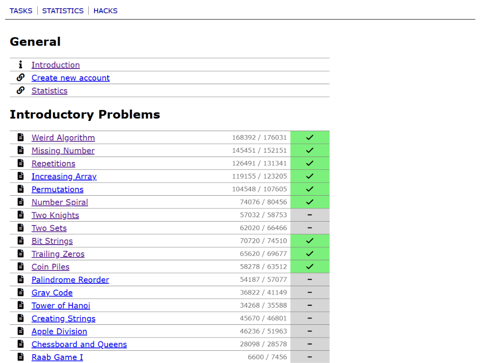
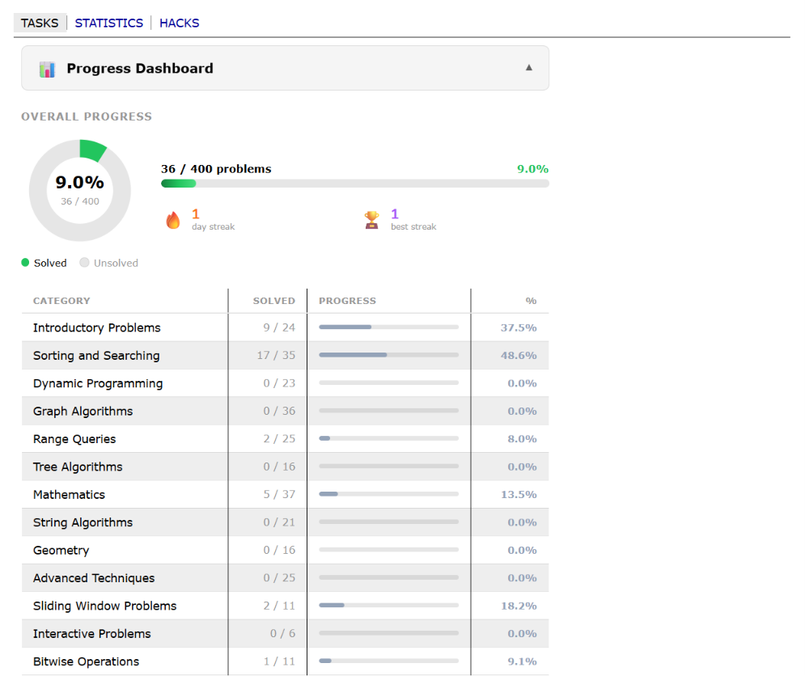
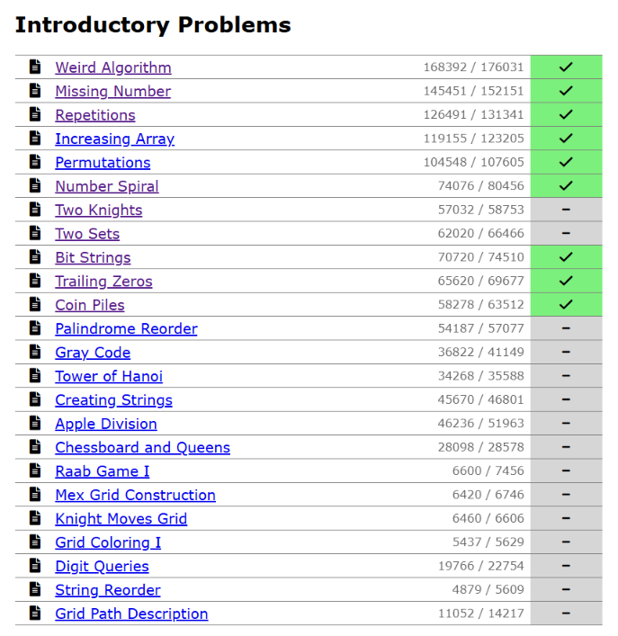
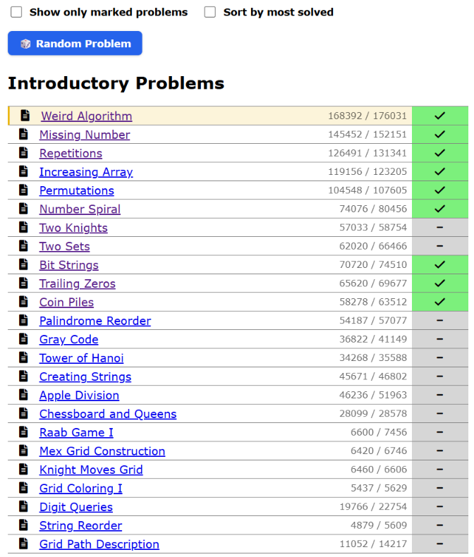
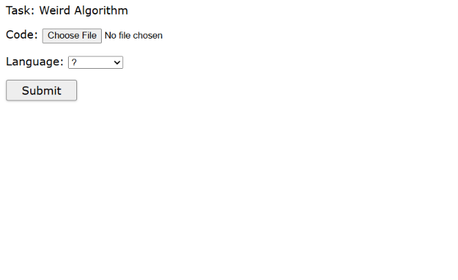
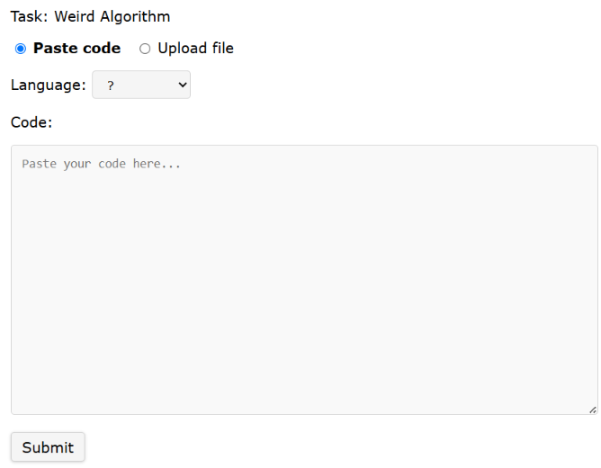
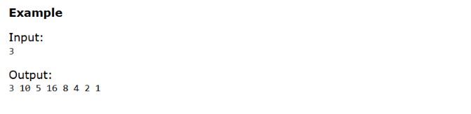
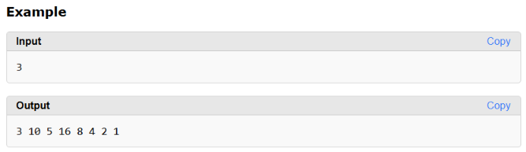
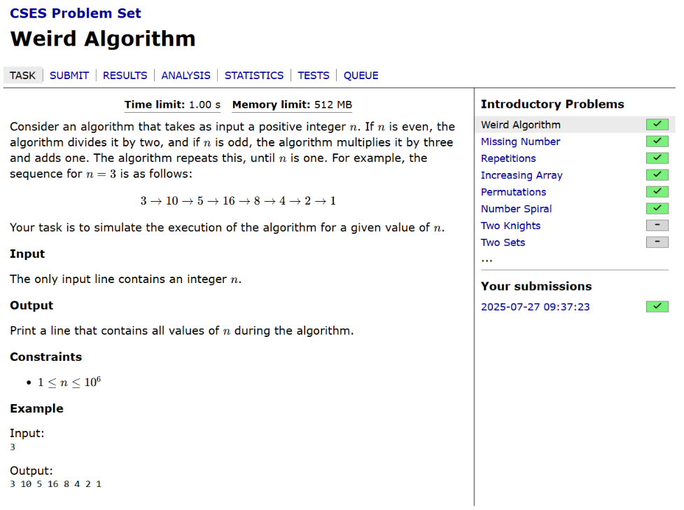
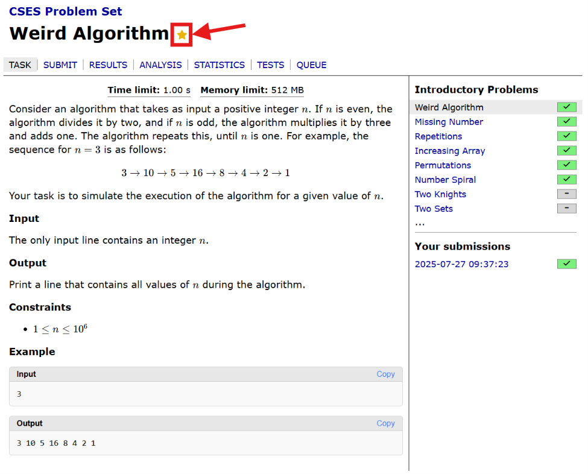

# CSES Pro — Ultimate CSES Enhancer (Chrome Extension)

A premium, feature-rich Chrome Extension that seamlessly enhances your competitive programming experience on [cses.fi](https://cses.fi/). It adds progress tracking, dynamic filtering, Codeforces-style code pasting and input/output copy buttons, streak tracking, and interactive dashboards—fully integrated into the CSES native user interface with adaptive light/dark theme support.

---

## 🚀 How to Install (100% Free & Open Source)

Because we believe this tool should be completely free for student developers, it is **not** published on the official Chrome Web Store (avoiding registration and listing fees). You can easily build and load it directly from the source code.

### 🛠️ Build and Load from Source

1. **Clone or Download the Repository**
   Download this project as a ZIP file and extract it, or clone it using git:

   ```bash
   git clone https://github.com/your-username/cses-pro.git
   cd cses-pro
   ```

2. **Install Developer Dependencies**
   Make sure you have [Node.js](https://nodejs.org/) installed. Run:

   ```bash
   npm install
   ```

3. **Build the Extension**
   Compile the TypeScript files and bundle the extension using Vite:

   ```bash
   npm run build
   ```

   _(Note: On Windows systems with strict script execution policies, you can run `cmd /c "npm run build"`)_

4. **Load the Extension in Google Chrome**
   - Open Chrome and navigate to: `chrome://extensions/`
   - Enable **Developer Mode** by toggling the switch in the top-right corner.
   - Click the **"Load unpacked"** button in the top-left corner.
   - Select the newly generated `dist` folder located in your project's root directory.
   - 🎉 You're done! Pin **CSES Pro** to your Chrome toolbar for quick access.

---

## ✨ Features

### 🔐 1. Multi-Account & Authentication Isolation

- **Seamless Switching:** Your solved problem statistics, daily streaks, and bookmarks are isolated and mapped specifically to your active CSES username. If you share a computer, the extension automatically switches user profiles as soon as a different account logs in.
- **Auto-Detection:** The extension reads the logged-in user directly from the CSES header navigation bar.
- **Privacy First:** When logged out, the extension securely unmounts the dashboard, pauses tracking, and protects your database profiles.

#### 🔄 Comparison

|           Before (Shared / Mixed Storage)            |     After (Isolated Profiles & Auto-detection)     |
| :--------------------------------------------------: | :------------------------------------------------: |
|  |  |

---

### 📊 2. Dynamic In-Page Progress Dashboard

The extension injects a premium dashboard directly at the top of the CSES Problemset pages (`/problemset` and `/problemset/list`) as well as on your public user profile page (`/user/USERNAME`).

- **Collapsible summary panel:** Styled with modern glassmorphism, backdrop filters, and hover transitions that blend natively with both CSES light and dark themes.
- **Interactive SVG Donut Pie Chart:** A smooth visualization showing your Solved vs Unsolved problem ratios.
- **Overall Progress stats:** Real-time problem counts (Solved / Total) and progress percentage calculated to exactly 1 decimal place.
- **Streak Tracking:** Displays your current daily solve streak (🔥) and your all-time best streak (🏆) using date calculation.
- **Category Progress Matrix:** A detailed table listing all CSES categories with custom progress bars indicating completion percentage.

#### 🔄 Comparison

|       Before (Linear Task Lists Only)       |       After (Premium Analytics Overlay)        |
| :-----------------------------------------: | :--------------------------------------------: |
|  |  |

---

### 🔍 3. Advanced Filtering & Sorting Controls

Injected right below the dashboard, these interactive toggles give you powerful control over the massive CSES problem list:

- **Show Only Marked Problems:** A checkbox filter that instantly narrows down the task lists to show only your bookmarked/starred problems. It automatically collapses and hides empty categories and category headers to clean up your view.
- **Sort by Most Solved:** A checkbox filter that re-orders the problems within each category in descending order of their total solve count (popularity). Unchecking it instantly restores the original CSES ordering.
- **🎲 Random Problem Selector:** Injects a button that redirects you to a random task. If you have "Show only marked problems" active, it intelligently selects from your bookmarked tasks; otherwise, it redirects to any random problem from the entire set.

#### 🔄 Comparison

|    Before (Static & Fixed Listings)    | After (Interactive Filters, Sorting & Random Pick) |
| :------------------------------------: | :------------------------------------------------: |
|  |     |

---

### 📝 4. Codeforces-Style Code Paste Submit Editor

- Replaces the native, restrictive file upload input on the `cses.fi/submit` page with a clean Codeforces-style code paste editor text area.
- Includes a toggle switch ("Paste code" / "Upload file") so you can switch back to standard file uploads at any time.
- **Auto Language Extension:** Detects your selected language (C++, Python, Java, Rust, etc.) in the dropdown, automatically names the virtual file (e.g., `solution.cpp`, `solution.py`), and handles the multi-part form submission transparently behind the scenes.

#### 🔄 Comparison

|             Before (File Upload Only)             | After (Text Paste Area with Auto File-Naming)  |
| :-----------------------------------------------: | :--------------------------------------------: |
|  |  |

---

### 📋 5. Codeforces-Style Copy Boxes

- Automatically transforms all standard input, output, and code block panels on problem task pages into structured, styled boxes.
- Injects a **"Copy"** button on the title header of each box. Clicking it instantly copies the contents to your clipboard with a 2-second visual confirmation ("Copied!").
- Integrates original page text (e.g., "Input" / "Output" paragraph labels) directly into the box headers for a clean, compact layout.

#### 🔄 Comparison

|     Before (Raw Preformatted Text)      |      After (Copy-to-Clipboard Wrapped Box)      |
| :-------------------------------------: | :---------------------------------------------: |
|  |  |

---

### ⭐ 6. Problem Bookmark Button

- Injects an elegant star bookmark icon (⭐) directly next to the problem title on all `cses.fi/problemset/task/*` pages.
- Bookmarking a problem highlights its row on the main problem list in a subtle gold accent, making it easy to spot and filter.

#### 🔄 Comparison

|      Before (No Problem Bookmarking)       |     After (One-click Star / Gold Highlighted Rows)     |
| :----------------------------------------: | :----------------------------------------------------: |
|  |  |

---

## 📁 Project Structure

This is the exact, complete file layout of the CSES Pro project workspace:

```
CSES Extension/
├── dist/                      # Bundled Chrome Extension files (auto-generated on build)
├── icons/
│   └── image.png              # Chrome toolbar and store icon
├── images/
│   └── .gitkeep               # Directory containing before/after comparison screenshots
├── public/
│   └── icons/                 # Subfolders matching manifest.json icon sizes
│       ├── icon128.png        # 128x128 pixel extension icon
│       ├── icon16.png         # 16x16 pixel extension icon
│       └── icon48.png         # 48x48 pixel extension icon
├── src/
│   ├── background/
│   │   └── sync.ts            # Background service worker message relayer and storage sync
│   ├── content/
│   │   ├── bookmarks.ts       # Injector for task page bookmarked star button (⭐)
│   │   ├── copyBlocks.ts      # Injector for Codeforces-style panel headers & Copy buttons
│   │   ├── injectDashboard.ts # Collapsible dashboard injection, SVG pie chart, and category stats
│   │   ├── solvedProblems.ts  # Solve scraping, bookmarked task filters, list sorting, and random button
│   │   ├── submitEditor.ts    # Code textarea injector and form payload processor
│   │   └── username.ts        # Detection script tracking authentication state
│   ├── data/
│   │   └── cses-problems.json # Index mapping CSES problem IDs to title and category meta
│   ├── services/
│   │   ├── parser.ts          # Core HTML DOM extraction functions for username and solves
│   │   └── storage.ts         # User-prefixed local storage accessors and legacy database migration
│   └── types/                 # Empty directory retained for tsconfig compiler mapping
├── .gitignore                 # Excludes build output, node_modules, and editor directories from Git
├── manifest.json              # Chrome Manifest V3 descriptor detailing file matches and script targets
├── package-lock.json          # Complete lockfile representing exact tree of active npm dependencies
├── package.json               # Node project metadata, build script definitions, and development modules
├── tsconfig.json              # Main TypeScript compilation parameters for the src codebase
├── tsconfig.node.json         # Node compilation environments for configuration files
└── vite.config.ts             # Bundler specifications wrapping crxjs plugin configurations
```

---

## ⚙️ How It Works (Under the Hood)

The extension relies on a clean, modular architecture combining Content Scripts, a Background Service Worker, and Chrome's Storage APIs:

1. **Scraping & Interaction Engine (`solvedProblems.ts`):** Scans the CSES problemset list page to harvest all problems with the green success badge (`.task-score.full`) and records them. It also injects the interactive filtering checkbox (to show only bookmarked tasks), the popularity sorting checkbox (to sort tasks by solve count), and the random problem selector. On task pages, it detects solves incrementally.
2. **Authentication Guards (`username.ts`):** Scans the CSES page header for the logged-in user profile link. If a user is logged in, it stores their username. If the user logs out, it clears the active username, causing the dashboard scripts to automatically skip rendering and maintain data privacy.
3. **Data Prefixing & Multi-Account Isolation (`storage.ts`):** All saved keys are dynamically prefixed with the active username. For example, if user `Nisarg` is logged in, their solved problems list is stored under `Nisarg_solvedProblems` while another user's is kept under `OtherUser_solvedProblems`. It also handles migrating legacy un-prefixed storage records.
4. **Theme Adaptation & Observers (`submitEditor.ts` & `injectDashboard.ts`):** Element backgrounds and borders use relative transparency values (`rgba(128, 128, 128, 0.08)`) and inherit theme colors using CSS variables. In `submitEditor.ts`, a `MutationObserver` watches the document `<head>` for stylesheet swaps to toggle color classes natively.
5. **Background Message Relay (`sync.ts`):** Listens for state update messages from content scripts and updates user-prefixed storage records asynchronously.
6. **In-page UI Injection (`injectDashboard.ts` & `bookmarks.ts`):** Uses vanilla DOM manipulation to construct and inject the collapsible Progress Dashboard at the top of the main listing, a profile summary on the user's stats page, and star bookmark buttons next to task headings.

---

## 📊 Local Storage Data Schema

All user data is stored inside Google Chrome's local database (`chrome.storage.local`). To isolate data profiles for multiple users, key names are dynamically prefixed with the active username at runtime:

```javascript
chrome.storage.local = {
  // Global active session pointer (Type: string | null)
  // Identifies which user profile is active. If logged out, this is null.
  username: "NISARG_07",

  // User isolated solved problem list (Type: Record<string, boolean>)
  // Maps solved task ID strings to true status.
  NISARG_07_solvedProblems: {
    1068: true,
    1069: true,
    1070: true,
  },

  // User bookmarked problems (Type: Record<string, boolean>)
  // Maps starred task ID strings to true status.
  NISARG_07_bookmarks: {
    1068: true,
  },

  // Daily solve dates and counts (Type: Record<string, number>)
  // Records the count of solved problems on specific dates.
  // Note: Although named 'heatmapData' in the codebase to align with background structures,
  // this is used exclusively to calculate and track your daily solve streaks (current and best streak).
  NISARG_07_heatmapData: {
    "2026-06-15": 2,
    "2026-06-16": 1,
  },

  // Unix timestamp of the last local database sync (Type: number)
  NISARG_07_lastUpdated: 1781603689000,
};
```

- **Automatic Migration:** On first load after logging in, the extension automatically migrates any legacy, un-prefixed storage keys (`solvedProblems`, `bookmarks`, `heatmapData`, `lastUpdated`) to the new user-prefixed namespace.

---

## 🎨 Theme & Design Token Guide

To ensure that the dashboard overlays fit CSES perfectly, we adhere to the following design tokens:

| Element / Action           | Color Token                                    | Native CSES Matching Style                                     |
| -------------------------- | ---------------------------------------------- | -------------------------------------------------------------- |
| Dashboard Card Background  | `rgba(128, 128, 128, 0.05)`                    | Blends smoothly with page background                           |
| Dashboard Border           | `rgba(128, 128, 128, 0.2)`                     | Matches native grid lines                                      |
| Progress Solved Indicator  | `#22c55e` (Green-500)                          | Matches CSES success badge                                     |
| Active Progress Bar        | `#2563eb` (Blue-600)                           | Standard utility progress                                      |
| Unsolved / Muted Indicator | `rgba(128, 128, 128, 0.8)`                     | Muted gray matching native secondary text                      |
| Streak Icon & Fire Count   | `#f97316` (Orange-500)                         | Custom active 🔥 color                                         |
| Best Streak & Trophy Count | `#a855f7` (Purple-500)                         | Custom milestone 🏆 color                                      |
| Font Families              | `inherit` (CSES native), `monospace` (streaks) | Inherits CSES body fonts to look like an official page feature |
